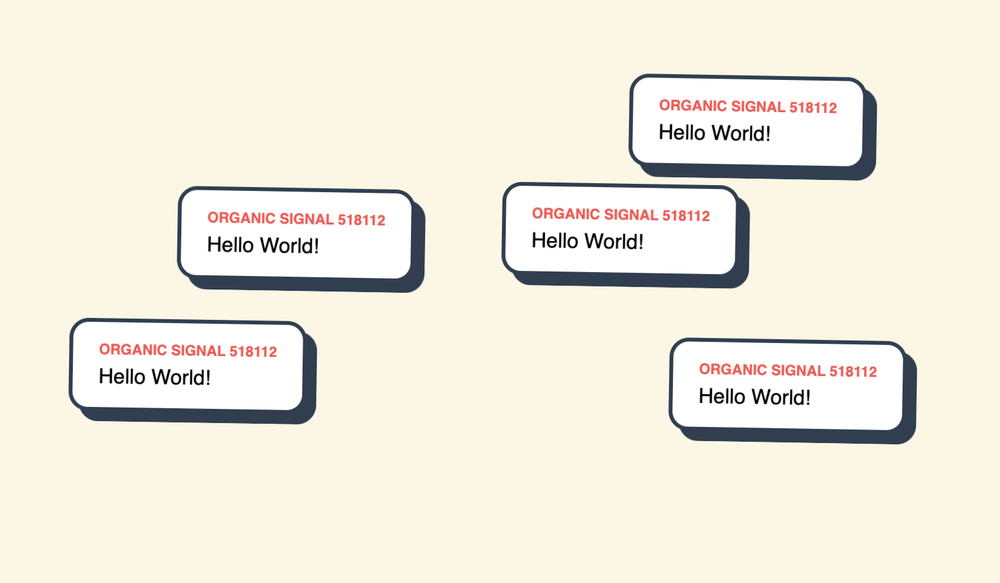

# 🗝️ Project LOW-KEY: Discover Local Organic Worlds

> "The city is talking. Are you scanning?"

- This repository contains the frontend "Key"—the lens through which you view your local world. LOW-KEY is a social experiment in Spatial Discovery. It doesn't care who you are; it only cares where you are.
- LOW-KEY stands for "Local Organic Worlds: Key to Discovery".



---

## 👁️ The Philosophy
Our infrastructure is built on three pillars. We call it The Organic Protocol.

### 📡 01. ORGANIC

**Gated by Proximity.**

Most social media is a "global shout." LOW-KEY is a "local whisper."

- Users are automatically grouped by their Public IP. (Note: You'll have to turn off your VPN to get the right Public IP)

- If you are on the same Wi-Fi (Campus, Library, Cafe), you share the same World.

- To see the thoughts of the space, you must physically be in the space.

### 🌬️ 02. EPHEMERAL

**Dissolve into the Void.**

Data shouldn't outlive its relevance.

- Every thought "cast" into the world is stateless.

- Thoughts drift, float, and eventually fade away (60-second lifespan).

- We have no database. Once a thought is gone, it is deleted from the universe's RAM forever.

### 👤 03. PRIVATE

**No Trace. No Gaze.**

We’ve stripped away the "Institutional Gaze" of the modern web.

- No Accounts: You are assigned a temporary persona.

- No Permanent Logs: We don't track your movement or your identity.

- No History: There is no "Profile" to curate. You exist only in the now.

- *Data Policy: We do not collect names or emails. To maintain network stability and enforce rate limits, our server temporarily sees your IP address and a session ID. This data is used solely for the "Scan" and is not sold, shared, or archived long-term.*

---

### 🛠️ How it Works

The Key connects to a Signaling Switchboard (our stateless Node/TS relay).

- Scan: Open the URL on local Wi-Fi.

- Identify: Receive a temporary, memorable persona.

- Cast: Send a thought into the local field.

- Fade: Watch your thought dissolve as you leave the zone.

---

### 🏗️ Technical Stack

- Frontend: Vanilla JS / CSS3 (PWA enabled)
- Backend: Node.js + TypeScript + Socket.io (Stateless)
- Hosting: GitHub Pages (Frontend) & Railway (Backend)

---

### The "No Trace" Promise

This project is built for the user, not the data-miner. By design, we cannot sell your data because we never held it in the first place.

---

### Installation for Developers
If you want to run your own "Key" locally:

Bash
```
git clone https://github.com/local-organic-worlds/key.git
cd key
# Run this in a separate tab:
npx tsc --watch
# Run a local server
python -m http.server 7788
```

